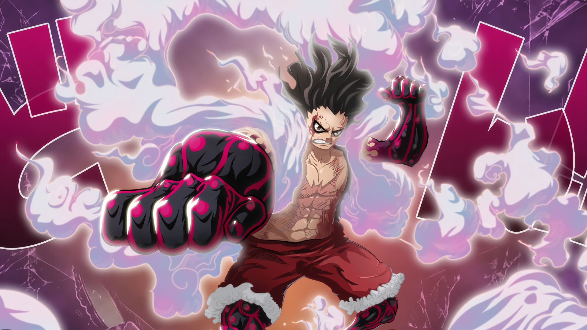

<!--StartFragment-->

**Monkey D. Luffy**, juga dikenal sebagai "Topi Jerami Luffy" dan umumnya sebagai "Topi Jerami", adalah protagonis utama dari manga dan anime, One Piece. Dia adalah pendiri dan kapten Bajak Laut Topi Jerami yang semakin terkenal dan kuat, serta salah satu dari empat petarung top. Impian seumur hidupnya adalah menjadi Raja Bajak Laut dengan menemukan harta karun legendaris yang ditinggalkan oleh Raja Bajak Laut yang terlambat, Gol D. Roger. Dia percaya bahwa menjadi Raja Bajak Laut berarti memiliki kebebasan terbanyak di dunia. Setelah invasi Totto Land dan tindakannya melawan Yonko Big Mom, dia saat ini dianggap oleh pers global untuk menjadi Kaisar Kelima.

Dia adalah putra dari pemimpin Revolusioner Monkey D. Dragon, cucu dari panglima marinir Monkey D. Garp, saudara angkat dari "Tinju Api" Portgas D. Ace dan Kepala Staf Revolusioner Sabo, dan putra angkat dari Curly Dadan.

Luffy memiliki reputasi di seluruh dunia karena menyebabkan masalah, menantang Shichibukai, Marinir, dan Yonko, juga melakukan tindak kejahatan dan tindakan yang dianggap mengancam oleh Pemerintah Dunia. Lebih jauh, di sebagian besar konfrontasi ini, ia telah muncul sebagai pemenang. Dia telah mendapatkan reputasi sebagai "ceroboh" dan, dalam beberapa kasus, "gila", setelah menyebabkan insiden di Enies Lobby, menyerang World Noble di Sabaody Archipelago, masuk dan keluar dari Impel Down (sementara secara tidak langsung menyebabkan skala besar kerusuhan dalam proses), dan bergabung dengan Pertempuran Marineford. Karena itu, ia terkenal karena menjadi satu-satunya bajak laut yang diketahui untuk tidak hanya dengan sengaja menyerang tiga fasilitas pemerintah yang paling penting, tetapi juga melarikan diri dari semuanya hidup-hidup setelah menghadapi lawan-lawan yang sangat kuat di masing-masing. kta tambahan bahwa ia menekan Dunia Noble dengan pengetahuan penuh tentang konsekuensi, serta warisan nya, telah menyebabkan Luffy untuk diberi label sebagai "Elemen Masa Depan Berbahaya", mendapatkan murka Armada Laksamana Sakazuki dan Markas Angkatan Laut.

Pada awal Reverie Arc, pencapaian Luffy dikompilasi, sangat menggembungkan keburukannya, yang sudah sangat besar untuk memulai. Ini termasuk hubungannya sebagai saudara yang disumpah untuk kedua almarhum komandan divisi kedua Bajak Laut Whitebeard dan putra Gol D. Roger, Portgas D. Ace, dan Kepala Staf Angkatan Darat Revolusioner, Sabo; armada yang secara tidak resmi terbentuk di bawahnya; operasi infiltrasi wilayah Big Mom, Totto Land, di mana ia mengalahkan Komandan Sweet Charlotte Cracker dan Charlotte Katakuri, berusaha melakukan pembunuhan terhadap Charlotte Linlin sendiri, menghancurkan kastilnya (secara tidak sengaja), dan menciptakan persekutuan yang cepat dengan Germa 66, Bajak Laut Matahari, dan Bajak Laut Fire Tank sebelum melarikan diri setelah pembunuhan gagal. Meskipun kemampuannya sedikit dibesar-besarkan oleh pers, prestasinya cukup besar baginya untuk secara tidak resmi berjudul "Kaisar Laut Kelima".

Tindakan-tindakan ini, antara lain, telah memberinya bounty saat ini sebesar 1.500.000.000. Memiliki bounty 300.000.000 sebelum kedatangannya di Kepulauan Sabaody, Luffy adalah salah satu dari sebelas rookie bajak laut yang telah mencapai Jalur Merah, bajak laut dengan bounty lebih dari 100.000.000 yang akan terus disebut sebagai "Generasi Terburuk".

**PENAMPILAN**

Luffy adalah seorang pria muda yang terkenal karena topi jerami khasnya (dari mana ia mendapat julukan "Topi Jerami Luffy"), yang dipinjamkan kepadanya ketika ia masih muda oleh kapten bajak laut legendaris, "Rambut Merah" Shanks, yang pada gilirannya menerimanya dari Gol D. Roger. Dia memakai celana pendek biru dengan manset, sandal, dan rompi merah tanpa lengan. Luffy juga memiliki bekas luka dengan dua jahitan di bawah mata kirinya (yang diperolehnya dengan menusukkan pisau di bawah matanya untuk menunjukkan pada Shanks bahwa dia tangguh dan tidak takut dengan rasa sakit) \[33] dan rambut hitam pendek yang berantakan. Dia terluka parah oleh Akainu dalam Pertempuran Marineford, meninggalkan bekas luka berbentuk X besar di dadanya.Tampak kurus di bawah kemejanya, ia memiliki fisik yang luar biasa bagus. Dia cukup pendek karena ia tampak dikerdilkan oleh sebagian besar individu dalam seri (meskipun harus dicatat bahwa karakter dalam One Piece sering sangat tinggi oleh standar kehidupan nyata).

**SEBELUM TIMESKIP**

Mirip dengan sebagian besar kru laki-laki, Luffy memiliki pakaian yang sama di sebagian besar seri, dibandingkan dengan kru lainnya (terutama Nami dan Nico Robin), yang sering berubah. Luffy dapat mengenakan pakaian yang berbeda untuk menyesuaikan dengan iklim sebuah pulau (seperti jaket berkerudung di Pulau Drum atau jubah gurun di Alabasta) tetapi akan beralih kembali ke rompi merah khasnya dan celana pendek biru setelah petualangan itu pulau sudah berakhir. Meskipun demikian, ia akan memakai pakaian yang biasa dalam warna yang berbeda dan telah dikenal untuk olahraga item lain-lain pada orangnya dari waktu ke waktu seperti di Thriller Bark dan Sabaody Archipelago. Menurut Eiichiro Oda, Luffy tidak tahu cara berpakaian dengan gaya sehingga terkadang dia disarankan tentang cara berpakaian oleh anggota tim yang sangat disukai seperti Sanji atau Usopp.

Tidak peduli di mana dia berada, Luffy memakai Topi Jeraminya melalui segalanya, meskipun di awal, topi itu cenderung mudah terlempar dari kepalanya, memaksa Luffy untuk menyingkirkannya atau meminta seseorang memegangnya selama perkelahian. Dari Arc Alabasta dan seterusnya, ia telah mendapatkan tali tali untuk itu, yang dijahit oleh Nami, memungkinkan topi untuk menggantung dari lehernya selama perkelahian.

Selama kembali ke Marineford untuk memberikan doa sunyi, Luffy secara singkat ditunjukkan dengan empat karakter yang ditulis di lengan kanannya mengeja 3D2Y, dengan 3D dicoret untuk melambangkan bahwa Bajak Laut Topi Jerami harus bertemu dalam 2 tahun (2Y) daripada 3 hari (3D) seperti yang direncanakan setelah melarikan diri dari Bartholomew Kuma.

**SETELAH TIMESKIP**

Setelah dua tahun, beberapa hal telah berubah. Luffy memakai kardigan merah terbuka dengan lengan panjang dengan empat kancing (yang menunjukkan bekas luka berbentuk X yang menutupi sebagian besar dadanya yang diterimanya saat itu oleh Laksamana Akainu), dengan selempang kuning diikatkan di pinggangnya, agak mengingatkan pada pakaian Gol D. Roger. Dia telah tumbuh sedikit lebih tinggi dan terbukti secara signifikan lebih berotot karena pelatihannya. Ini bisa dilihat di lehernya yang agak lebih tebal, deltoids yang lebih jelas, dan dada yang lebih baik. Selama pertarungannya dengan Sanji, Luffy kehilangan salah satu gigi puncaknya setelah dipukul oleh Joue Shot Diable Jambe langsung ke wajahnya. Namun, tumbuh kembali setelah dia meminum sebotol susu.

<!--EndFragment-->